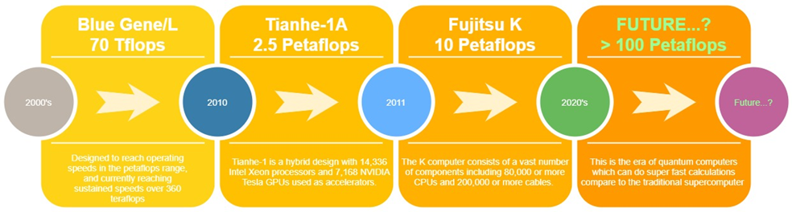

# Pipelining and Supercomputers

## Pipelining

Pipelining is the simultaneous execution of more than one instruction from the processors through a pipeline \[1].

To understand the pipelining concept, let’s imagine a laundry process to serve three different people in the laundry service. In the laundry process, you must put your clothes into the washing machine, put the clothes into the dryer, and folding the clothes.

.png>)

Each block of the process has time to consume, which can be assumed as a clock in the computer processor. The washing machine in the above process might be idle while waiting for the whole process to finish. To make it efficient, after the first process finish, simultaneously, the washing machine can be utilized for the next person to start his washing process.

.png>)

Like the processor in the computer, it is used to organized instructions concurrently, to manage overlapped instruction execution, with fewer clock cycles which increase better performance. This kind of optimization is only possible if the instruction is not dependent each other. From the above example, if each process takes 10 minutes, 1 cycle will need 30 minutes, and in total for 3 cycles will need 90 minutes. But with pipelining, for the whole cycle, it’s only needs 50 minutes for 3 cycles.

In conclusion, pipelining is a concept of overlapped instruction execution that allowed more instructions executed with fewer clock cycles which result in better performance.

## Supercomputers

A supercomputer is a machine designed to perform high computational process with high efficiency \[2, p.364]. Supercomputer performance measured in floating point operations per second (FLOP). In integer operation, computer can calculate very fast operation. But in real life, the calculation will include square roots, trigonometry, etc, which has the result in float number \[3]. Therefore, supercomputer used FLOP as the measure. Supercomputer used more than tens of thousands processor and can perform billion to trillions of calculations or computation per second.

From the beginning of supercomputer era with the performance of only 3 Mflops until in 1990’s with the performance of 143 Gflops, in 2020’s the supercomputer performance reach 70 Tflops. The performance increase factor includes data storage capacity, memory size, and IO capabilities \[2, p.365].

Fig. 1 Example of supercomputers \[2, p.365]

The future of supercomputers is quantum computing. Quantum computing can solve the computational problem which can’t be resolved with the current computer. Quantum computer has different from the classic computer which only has binary 0 and 1 in the computation, while the quantum computer works with interdependent and nonlinear structures called qubits which can result in the interchange of different states between 0 and 1 during computation at the same time \[4]. In the application, one of the search method algorithms is called Grover’s search, in the classical computer you will search N/2 times, or the worst case is N times. But in quantum computing, you will need  times which increases processing efficiency. As the comparison, in the classic computer, you will need 1 week to solve a computation compare to about 1 second in the quantum computer \[5].

## References

\[1]   Geeks for Geeks. Computer Organization and Architecture. Geeksforgeeks.org \[Online].

[https://www.geeksforgeeks.org/computer-organization-and-architecture-pipelining-set-1-execution-stages-and-throughput/](https://www.geeksforgeeks.org/computer-organization-and-architecture-pipelining-set-1-execution-stages-and-throughput/) \[Accessed: July 2021]

\[2]   C. Bailey, _From Architectures to Operating Systems,_ 2nd ed. United Kingdom, Independently Published, 2021

\[3]   Suse. Suse Technology Definition. Susedefines.suse.com \[Online]. [https://susedefines.suse.com/definition/supercomputer/](https://susedefines.suse.com/definition/supercomputer/) \[Accessed: July 2021]

\[4]   AI Multiple. Research AI Multiple. Research.aimultiple.com \[Online] [https://research.aimultiple.com/future-of-quantum-computing/](https://research.aimultiple.com/future-of-quantum-computing/) \[Accessed: July 2021]

\[5]   IBM. IBM Articles. Ibm.com \[Online]. [https://www.ibm.com/quantum-computing/what-is-quantum-computing/](https://www.ibm.com/quantum-computing/what-is-quantum-computing/) \[Accessed: July 2021]

&#x20;
